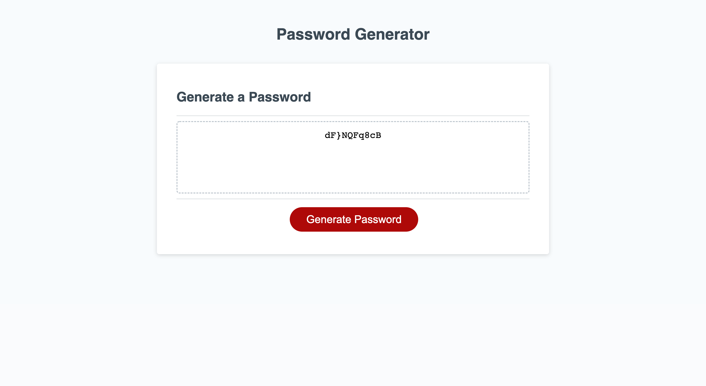

# passowrdGenerator_JD
Javascript hw, assignment 3 for UCf bootcamp

Completed by Joshua Diaz

# Project Description:

Produced a Password Generator using Javascript, HTML, and CSS (HTML and CSS provided). Using functions, defined with If statements and linked to one another to produce a series of prompts that the user can confirm or cancel in order for the program to provide the desired password style.

# Project Location:
[Github Live Link](https://jdiaz240.github.io/passowrdGenerator_JD/)

[Github repository](https://github.com/Jdiaz240/passowrdGenerator_JD)

# Project Screenshot:

